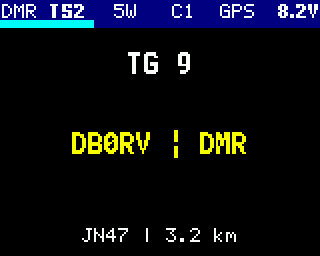

# OpenGD77 
## Firmware for DMR Radios

The codeplug and information available here are built and intended to be used for our local amateur radio club ["P09"](https://www.darc.de/der-club/distrikte/p/ortsverbaende/09/) as part of the [DARC](https://www.darc.de/home). This repository is therefore especially useful to be used within the location ***JN47***.

> [!WARNING]
> This repository only maintains software and code for the ***Retevis RT3S*** or other rebranded radios of the same type like TYTs so far. While OGD77 supports more radios than the RT3S as well, those radios are not listed in here yet.

> [!NOTE]
> Current local database includes `272321 DMR IDs` fetched from [RadioID](https://radioid.net).
> 
> *(As of 23.07.2024)*

---

